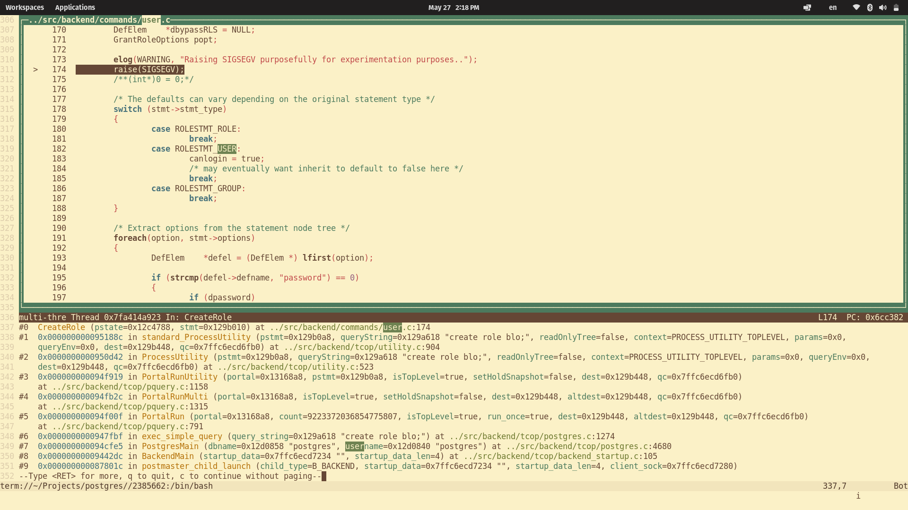

# PostgreSQL Database Management System

This directory contains the source code distribution of the PostgreSQL
database management system.

PostgreSQL is an advanced object-relational database management system
that supports an extended subset of the SQL standard, including
transactions, foreign keys, subqueries, triggers, user-defined types
and functions.  This distribution also contains C language bindings.

Copyright and license information can be found in the file COPYRIGHT.

General documentation about this version of PostgreSQL can be found at
<https://www.postgresql.org/docs/devel/>.  In particular, information
about building PostgreSQL from the source code can be found at
<https://www.postgresql.org/docs/devel/installation.html>.

The latest version of this software, and related software, may be
obtained at <https://www.postgresql.org/download/>.  For more information
look at our web site located at <https://www.postgresql.org/>.


## Core dump

This is just an experiment to cause a segfault in postgres, get a core dump and then analyze it with GDB.



- Enable core dumps in linux:

```
$ ulimit -c unlimited
$ mkdir -p /var/coredumps
$ chmod a+w /var/coredumps
$ sysctl kernel.core_pattern=/var/coredumps/core-%e-%p
```

- Add core files option to pg_ctl :

```
$ pg_ctl start -core-files
```

- Compile and exec this branch. Note: you need to compile pg with debug symbols `-g` enabled, by default this is the case with `meson`.

```
$ nix-shell
$ meson
$ cd build
$ ninja && ninja install
& cd ..
$ with-pg psql


```bash
postgres=# create role blo;

2024-05-27 14:45:43.894 -05 [2402762] WARNING:  Raising SIGSEGV purposefully for experimentation purposes..
WARNING:  Raising SIGSEGV purposefully for experimentation purposes..
server closed the connection unexpectedly
        This probably means the server terminated abnormally
        before or while processing the request.
The connection to the server was lost. Attempting reset: Succeeded.
```

- Check the core dump

```
$ du -sh /var/coredumps/core-postgres-2394351
145M
$ file /var/coredumps/core-postgres-2394351
core-postgres-2394351: ELF 64-bit LSB core file, x86-64, version 1 (SYSV), SVR4-style, from 'postgres: postgres postgres [local] CREATE ROLE', real uid: 1000, effective uid: 1000, real gid
: 1000, effective gid: 1000, execfn: '/home/stevechavez/Projects/postgres/build/bin/postgres', platform: 'x86_64'
```

- Use gdb

```
$ gdb -c /var/coredumps/core-postgres-2394351 ./build/bin/postgres

(gdb) tui enable
(gdb) bt # get a backtrance
(gdb) f 3 # jump to func
(gdb) p *portal # print variables
$1 = {name = 0x131a290 "", prepStmtName = 0x0, portalContext = 0x12c4690, resowner = 0x12d39e0, cleanup = 0x66c774 <PortalCleanup>, createSubid = 1, activeSubid = 1, createLevel = 1,
  sourceText = 0x129a618 "create role blo;", commandTag = CMDTAG_CREATE_ROLE, qc = {commandTag = CMDTAG_CREATE_ROLE, nprocessed = 0}, stmts = 0x129b400, cplan = 0x0, portalParams = 0x0,
  queryEnv = 0x0, strategy = PORTAL_MULTI_QUERY, cursorOptions = 4, run_once = true, status = PORTAL_ACTIVE, portalPinned = false, autoHeld = false, queryDesc = 0x0, tupDesc = 0x0,
  formats = 0x0, portalSnapshot = 0x12cc800, holdStore = 0x0, holdContext = 0x0, holdSnapshot = 0x0, atStart = true, atEnd = true, portalPos = 0, creation_time = 770152156020410,
  visible = false}
```

## References

- https://www.highgo.ca/2020/11/07/how-to-analyze-a-postgresql-crash-dump-file/
- https://www.enterprisedb.com/docs/epas/latest/installing/troubleshooting/linux_troubleshooting/enabling_core_dump/
- https://stackoverflow.com/questions/64152039/how-to-change-postgresql-12-crash-dump-location-path
